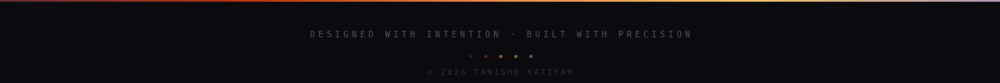

<div align="center">



<br/>

[](https://github.com/TanishqKatiyar)

<br/>

<a href="https://github.com/TanishqKatiyar?tab=followers"></a>&nbsp;&nbsp;
&nbsp;&nbsp;
<a href="https://github.com/TanishqKatiyar?tab=repositories"></a>

</div>

<br/>


<br/>

<table>
<tr>
<td width="40%" valign="top">

###  `whoami`

```js
const tanishq = {
  role: "AI Software Engineer",
  location: "India 🇮🇳",
  focus: [
    "Intelligent Agent Systems",
    "Multi-LLM Orchestration",
    "Real-time Communication",
    "Full-Stack Architecture"
  ],
  philosophy: "Build systems that think,
    scale, and adapt."
};
```

</td>
<td width="60%" valign="top">

### ✦ What I'm Building

> **🤖 AI Interview Agents** — Real-time WebRTC screening with multi-LLM routing & speech analytics
>
> **🛡️ Anti-Fraud Systems** — ML-driven anomaly detection with geospatial risk scoring
>
> **💰 Smart Finance Tools** — Voice-first AI expense tracking with predictive analytics
>
> **🍔 Production Platforms** — Full-stack delivery apps with live order tracking

<br/>

```
 ╭──────────────────────────────────────╮
 │  ✦ Open to collaborate on AI/ML     │
 │  ✦ Building in public               │
 │  ✦ Systems > Scripts                 │
 ╰──────────────────────────────────────╯
```

</td>
</tr>
</table>

<br/>


<br/>

<div align="center">

### ✦ `S I G N A T U R E   W O R K S`

<br/>

</div>

<table>
<tr>
<td width="50%" valign="top">

<div align="center">

**[`🤖 AI INTERVIEW AGENT`](https://github.com/TanishqKatiyar/Interview_agent-)**

<sup>Enterprise AI Screening System</sup>

</div>

<br/>

End-to-end AI tutor screening platform with **real-time WebRTC audio**, dynamic multi-LLM routing, deep speech analytics, and automated assessment pipelines.

<br/>

<div align="center">


 

</div>

</td>
<td width="50%" valign="top">

<div align="center">

**[`🛡️ ANTI-FRAUD DELIVERY`](https://github.com/TanishqKatiyar/Anti-fraud-delivery-system)**

<sup>ML-Powered Fraud Detection</sup>

</div>

<br/>

Intelligent delivery verification with **real-time anomaly detection**, geospatial analysis, photo verification AI, and automated risk scoring engine.

<br/>

<div align="center">


 

</div>

</td>
</tr>
<tr>
<td width="50%" valign="top">

<div align="center">

**[`💰 SMART EXPENSE TRACKER`](https://github.com/TanishqKatiyar/Smart-Expense-Tracker)**

<sup>AI Financial Intelligence</sup>

</div>

<br/>

Voice-first expense tracking with **AI-powered categorization**, real-time voice assistant, spending predictions, and interactive analytics dashboard.

<br/>

<div align="center">


 

</div>

</td>
<td width="50%" valign="top">

<div align="center">

**[`🍔 FOODIE EXPRESS`](https://github.com/TanishqKatiyar/Foodie-express-web-application)**

<sup>Full-Stack Delivery Platform</sup>

</div>

<br/>

Production food delivery with **user auth, live order tracking**, payment integration, restaurant management, and fully responsive mobile-first UI.

<br/>

<div align="center">


 

</div>

</td>
</tr>
</table>

<br/>


<br/>

<div align="center">

### ✦ `T E C H   A R S E N A L`

<br/>

<table>
<tr>
<td align="center" width="25%">

**`🧠 AI / ML`**

<br/>


</td>
<td align="center" width="25%">

**`🌐 Frontend`**

<br/>


</td>
<td align="center" width="25%">

**`⚙️ Backend`**

<br/>


</td>
<td align="center" width="25%">

**`☁️ Cloud / Data`**

<br/>


</td>
</tr>
</table>

</div>

<br/>


<br/>

<div align="center">

### ✦ `A N A L Y T I C S`

<br/>


<br/><br/>


<br/><br/>


</div>

<br/>


<br/>

<div align="center">

### ✦ `T R O P H I E S`

<br/>


</div>

<br/>


<br/>

<div align="center">

### ✦ `C O N N E C T`

<br/>

<a href="https://github.com/TanishqKatiyar">
  
</a>
&nbsp;
<a href="mailto:tanishqkatiyar@gmail.com">
  
</a>

<br/><br/>


<br/><br/>

</div>


